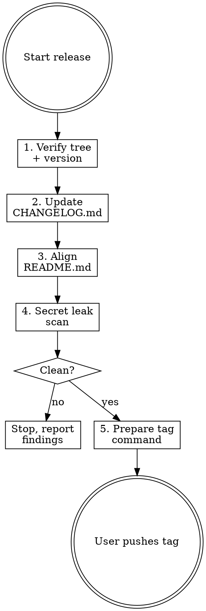

# Releasing cc-dispatch

Prepare a release for cc-dispatch. Target version: `$ARGUMENTS` (if empty, ask the user for the version first).

## Overview

cc-dispatch releases are built by the existing GoReleaser pipeline in `.github/workflows/release.yml`, triggered by pushing a version tag. This skill prepares everything that must be right *before* the tag is pushed, then emits the tag command for the user to run.

**Scope:** CHANGELOG update → README alignment → secret leak scan → tag prep. Does NOT push. The user pushes the tag.

## Task Initialization (MANDATORY)

Before ANY action, create the task list using TaskCreate:

1. `[releasing] Verify working tree + version`
2. `[releasing] Update CHANGELOG.md`
3. `[releasing] Align README.md`
4. `[releasing] Secret leak scan`
5. `[releasing] Prepare tag command`

Mark each `in_progress` before starting, `completed` only after its verification passes.

## Task 1: Verify Working Tree and Version

**Goal:** Confirm the repo is in a releasable state and the target version is sane.

1. Run `git status --porcelain`. Working tree MUST be clean. If not, stop and report.
2. Run `git fetch --tags` then `git tag --sort=-v:refname | head -5`. Show the five most recent tags.
3. Confirm `$ARGUMENTS` is strictly greater than the latest tag (semver compare). If lower or equal, stop and ask the user.
4. Confirm current branch is `main` (or user-confirmed release branch). If not, ask before proceeding.

**Verification:** Clean tree, valid version ordering, user-approved branch.

## Task 2: Update CHANGELOG.md

**Goal:** Add a new release section at the top with the categorized commits since the last tag.

1. Read `CHANGELOG.md` (if missing, create with a `# Changelog` header and a `## [Unreleased]` section).
2. Run `git log --pretty=format:"%h %s" <latest-tag>..HEAD` to list commits since the last release.
3. Categorize under standard Keep-a-Changelog headings:
   - `### Added` — new features (`feat:` prefix)
   - `### Changed` — changes to existing behavior (`refactor:`, `perf:`)
   - `### Fixed` — bug fixes (`fix:` prefix)
   - `### Docs` — documentation-only changes
   - `### Breaking` — ONLY if a commit body contains `BREAKING CHANGE:` or the `!` conventional-commit marker. Surface prominently.
4. Insert a new section `## [$ARGUMENTS] - YYYY-MM-DD` above the `[Unreleased]` section. Use today's date.
5. Keep commit subjects concise; drop trailing `(#123)` PR numbers only if they hurt readability.
6. Edit the file via Edit; show the user the diff before moving on.

**Verification:** CHANGELOG.md has a new dated section for `$ARGUMENTS` with categorized entries. Breaking changes are called out if present.

## Task 3: Align README.md

**Goal:** Make sure install/usage snippets reflect the new version.

1. Grep `README.md` for the previous tag (without the `v` and with it) and any hard-coded version strings.
2. If the install command references a version, update to `$ARGUMENTS`. The project's current install line (as of writing) pins to `main` via `curl ... | sh`, so usually no change is needed — confirm by reading the file.
3. If a `Releases` link or version badge exists, align it.
4. If nothing needs changing, state that explicitly.

**Verification:** README references to the previous version (if any) updated; no stale version strings remain.

## Task 4: Secret Leak Scan

**Goal:** Make sure no file staged for release leaks the local auth token or other secrets. `~/.cc-dispatch/config.json` contains a bearer token — it must NEVER appear in the repo.

Scan tracked files for:

1. The literal string `~/.cc-dispatch/config.json` accompanied by a token value.
2. Bearer token patterns: `Authorization: Bearer [A-Za-z0-9_\-]{20,}`.
3. Any file literally named `config.json` or `*.token` under paths that would be committed.
4. Hex strings that could be credentials (32+ hex chars adjacent to `token`, `secret`, `key`, `password`).

Use Grep with these patterns. If anything matches, stop and report — do NOT continue to Task 5 until resolved.

**Verification:** Zero matches, or user has explicitly cleared each finding as a false positive.

## Task 5: Prepare Tag Command

**Goal:** Emit the exact tag command for the user to run. Do NOT execute it.

1. Stage the CHANGELOG / README changes: `git add CHANGELOG.md README.md` (only the files actually modified).
2. Create the release-prep commit: `git commit -m "chore(release): $ARGUMENTS"`.
3. Emit (do not run) the following commands for the user:
   ```
   git tag -a $ARGUMENTS -m "Release $ARGUMENTS"
   git push origin main
   git push origin $ARGUMENTS
   ```
4. Remind: the `release.yml` workflow triggers on tag push. After tag push, GoReleaser builds binaries and creates the GitHub Release.

**Verification:** Commit created locally. Tag command printed but not executed. User acknowledges they will push manually.

## Red Flags — STOP

| Thought | Reality |
|---------|---------|
| "Skip CHANGELOG, commits speak for themselves" | Downstream users read CHANGELOG, not git log. Always update it. |
| "Secret scan is paranoid" | One leaked bearer token invalidates every `~/.cc-dispatch/` install. Non-negotiable. |
| "I'll push the tag myself" | This skill prepares. The user pushes. Do not `git push` from inside the skill. |
| "Version ordering is obvious" | Typos in semver happen. Verify against `git tag --sort=-v:refname`. |
| "Working tree has one tiny unrelated change, fine" | No. Stop. Commit or stash first; release commits must be clean. |

## Common Rationalizations

| Excuse | Reality |
|--------|---------|
| "User can fill CHANGELOG later" | "Later" becomes "never". Do it now. |
| "README is always out of date anyway" | That's the bug. Fix it at release time. |
| "A leak scan is overengineering" | It's one Grep run. Run it. |
| "`git add -A` is faster" | Per the global rule (`~/.claude/rules/git-safety.md`), stage specific files. |

## Flowchart



## References

- `.claude/rules/daemon-stability.md` — breaking changes to daemon/schema need a `### Breaking` entry and major-version bump
- Global rule `~/.claude/rules/git-safety.md` — staging and force-push rules
- `.github/workflows/release.yml` — what triggers when the tag is pushed
