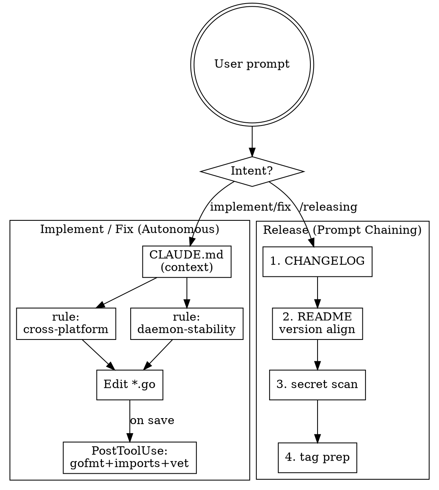

# Agent System Component Plan

**Date:** 2026-04-21 16:32
**Based on:** `.rcc/20260421-162905-workflows.md` (no analysis report — fresh project)

## Architecture Flowchart

## Workflow Pattern Mapping

| Workflow | Anthropic Pattern | Rationale |
|----------|------------------|-----------|
| Implement / fix | Autonomous Agent | Situational, owner-pipe; LLM decides next step guided by rules |
| Release prep | Prompt Chaining | Fixed 4-step sequence with deterministic order |
| Edit-triggered quality check | (infrastructure) | PostToolUse hook — not a workflow pattern |

## Dependency Graph & Phases

| Component | Depends On | Depended By | Phase | Core/Enhancement |
|-----------|-----------|-------------|-------|-----------------|
| `CLAUDE.md` | — | all rules, hook, skill | 1 | core |
| `.claude/rules/cross-platform.md` | — | hook (advisory) | 1 | core |
| `.claude/rules/daemon-stability.md` | — | — | 1 | core |
| `.claude/hooks/go-format-vet.sh` + settings registration | CLAUDE.md, rules | — | 2 | enhancement |
| `.claude/skills/releasing/SKILL.md` | CLAUDE.md | — | 2 | enhancement |

## Execution Order

- **Phase 1 (foundation, parallel):** `CLAUDE.md`, `rule:cross-platform`, `rule:daemon-stability`
- **Phase 2 (capabilities, parallel):** `hook:go-format-vet`, `skill:releasing`

## Implementer Capability Analysis

Implementer = Sonnet. Project-specific signal beyond Claude's training:

| Knowledge Gap | Component |
|---------------|-----------|
| Cross-platform behavior must be isolated with build tags (prior Windows test incident) | `rule: cross-platform` |
| Daemon HTTP protocol is frozen; sqlite schema changes require migration | `rule: daemon-stability` |
| `~/.cc-dispatch/config.json` contains auth token — never echo / commit | CLAUDE.md note |
| Zero-runtime-dependency promise (single static binary, no Node/Python) | CLAUDE.md note |
| Verification commands: `go test ./...`, `go build ./cmd/ccd` | CLAUDE.md section |

Excluded (already known to Claude or enforced elsewhere): Go fmt conventions (hook), standard error wrapping (linter in CI), conventional commits (user's global rules).

## Agent Layer Decisions

- **Implementer (Sonnet):** Establish via rules + CLAUDE.md; no dedicated agent file needed (main conversation is the implementer).
- **Orchestrator:** SKIPPED — solo dev, single-implementer workflow; dedicated orchestrator adds overhead without value.
- **Opus quality gate:** SKIPPED — no revision loop planned; user reviews own diffs.

## Safety Baseline

Inherited from `~/.claude/rules/`:

| Global Rule | Covers |
|-------------|--------|
| `git-safety.md` | Force push confirmation, no `git add -A`, gitignore verification |
| `deployment.md` | Deploy safety (mostly non-applicable — no ansible here) |
| `clean-architecture.md` | Refactoring triggers, dependency direction |
| `dependencies.md` | Latest-stable rule, authoritative URL preference |
| `memory-index-sync.md` | `.rcc/` artifact index discipline |
| `chinese-writing.md` | Communication style |

**Decision:** No project-level duplicates needed. User has equivalent global rules.

## Components

### 1. CLAUDE.md
- **Action:** create
- **Key content:**
  - One-paragraph project purpose (Go CLI + daemon + MCP server for dispatching headless Claude sessions)
  - Subsystem map pointer (README has diagram)
  - Verification commands: `go test ./...`, `go vet ./...`, `go build ./cmd/ccd`
  - Constraints: zero runtime deps; do not expose `~/.cc-dispatch/config.json`
  - Communication: reply in Traditional Chinese
  - Pointers to `.claude/rules/cross-platform.md`, `.claude/rules/daemon-stability.md`
- **Writing skill:** `writing-claude-md`
- **Traces to:** All workflow/constraint findings
- **Size budget:** < 80 lines

### 2. Rule: cross-platform
- **Action:** create
- **Path:** `.claude/rules/cross-platform.md`
- **Scope (frontmatter `paths`):** `**/*.go`
- **Key constraints:**
  - OS-specific code/test must be isolated behind build tags (`//go:build linux`, `//go:build windows`, `//go:build !windows`)
  - Reference the prior incident (commit `6c6a80d`) as the rationale
  - Unified filename convention: `*_unix.go`, `*_windows.go` where applicable
- **Writing skill:** `writing-rules`
- **Traces to:** Pain point "platform-specific code breaks cross-platform builds"
- **Size budget:** < 30 lines

### 3. Rule: daemon-stability
- **Action:** create
- **Path:** `.claude/rules/daemon-stability.md`
- **Scope (frontmatter `paths`):** `internal/daemon/**`, `internal/mcp/**`, `internal/db/**`, `internal/client/**`
- **Key constraints:**
  - Daemon HTTP RPC endpoint shape is part of the public contract — no silent rename/removal
  - sqlite schema changes require a migration in `internal/db/` and documented reason
  - MCP tool signatures (`dispatch_start`, `dispatch_list`, etc.) must not change arg shape without versioning
- **Writing skill:** `writing-rules`
- **Traces to:** Pain point "breaking changes to daemon HTTP protocol or sqlite schema"
- **Size budget:** < 40 lines

### 4. Hook: go-format-vet
- **Action:** create
- **Files:**
  - `.claude/hooks/go-format-vet.sh` (executable shell)
  - Registration in `.claude/settings.json` under `hooks.PostToolUse`
- **Event:** `PostToolUse`, matcher `Edit|Write`
- **Behavior:**
  - Filter: only run when tool input `file_path` ends with `.go`
  - Run `gofmt -w <file>` + `goimports -w <file>` (mutate file)
  - Run `go vet ./...` (report only; exit code 2 on failure → block with message)
  - SKIP `golangci-lint` in hook (too slow; CI handles)
- **Performance target:** < 3s typical
- **Writing skill:** `writing-hooks`
- **Traces to:** Routine "format + static check on every `.go` edit"
- **Settings scope:** `.claude/settings.json` (team-shared, not safety-bypass)

### 5. Skill: releasing
- **Action:** create
- **Path:** `.claude/skills/releasing/SKILL.md`
- **Trigger description:** "Use when preparing a cc-dispatch release: updating CHANGELOG, aligning README version, scanning for secret leaks, preparing git tag."
- **Chained steps (Prompt Chaining):**
  1. Update `CHANGELOG.md` from commits since last tag
  2. Align README version / install command with new tag
  3. Scan tracked files for `~/.cc-dispatch/config.json` content patterns + bearer tokens
  4. Prepare tag message; user executes `git tag` + `git push --tags`
- **Assets:** none initially (simple chain; templates can follow if patterns recur)
- **Writing skill:** `writing-skills`
- **Traces to:** Routine "release prep ritual"
- **Size budget:** < 120 lines

## Expected Fixes

| Weakness | Component | How It Fixes |
|----------|-----------|-------------|
| Platform-specific code breaks cross-platform builds | `rule: cross-platform` | Path-scoped rule enforces build tags on any `*.go` edit |
| Daemon protocol / sqlite schema drift | `rule: daemon-stability` | Path-scoped rule requires migration + versioning for stability-critical packages |
| Missed fmt/vet on edit | `hook: go-format-vet` | PostToolUse auto-runs on `.go` writes; blocks on vet failure |
| Inconsistent release prep | `skill: releasing` | Prompt-chained skill runs the 4-step ritual in fixed order |
| Missing project context / auth token leaks | `CLAUDE.md` | Documents constraints and token handling inline |

## Conflict Checks

- No existing `.claude/` directory — no duplication risk.
- No existing CLAUDE.md — no content conflict.
- No existing hooks — no event-matcher overlap.
- User's `~/.claude/rules/` reviewed — no project rule duplicates global scope.

## Next Step

Invoke `applying-agent-systems` with this plan path to build Phase 1 then Phase 2 components.
